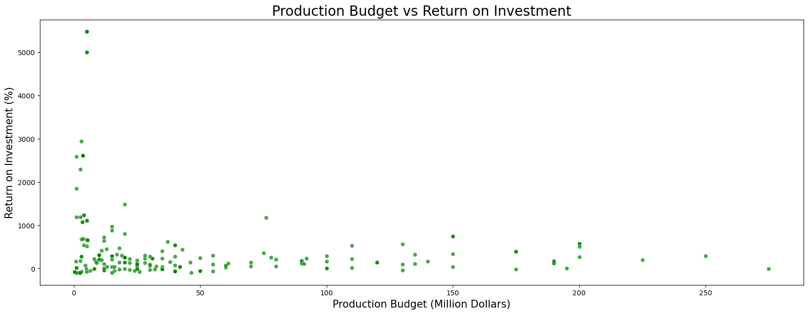

## Project Overview
Microsoft has assigned me the responsibility of assessing the movie industry's potential and providing recommendations to assist in their decision-making process. This evaluation will entail analyzing the profitability of various genres, with ROI as a central metric. I will thoroughly examine the top-performing studios in the movie box office and explore the genres with the highest viewer ratings to generate insights for my analysis.

### Business Problem
Microsoft aims to join the ranks of major companies venturing into original video content creation, prompting them to embark on establishing a new movie studio. However, their lack of experience in the movie-making domain poses a significant challenge. Microsoft endeavors to create content that can compete with established giants like Warner Bros and Walt Disney. To achieve this goal, Microsoft must gain a comprehensive understanding of audience preferences and industry trends. They need to formulate a strategy that effectively balances the costs of content creation with potential revenue streams such as subscriptions or advertising.

In my assessment, I will focus on determining the most popular genres, identifying the top-performing studios in the movie industry, and analyzing the relationship between production expenditure and return on investment.

### The Data
My analysis entails leveraging data sourced from three distinct movie websites: TMDB, The Numbers, and Box Office Mojo. The dataset "bom.movie_gross.csv" comprises movie titles, studios, domestic and foreign financial earnings, and release years.

The second dataset, tn.movie_budgets.csv, provides details on movie releases, encompassing titles, release dates, production budgets, and worldwide gross. The focal point of interest in this dataset is the return on investment, with the monetary data columns serving as the primary rationale for its selection.

The third dataset, tmdb.movies.csv, comprises genre codes, original language, original movie titles, popularity metrics, release dates, and votes. It was employed to translate genre codes into genre names, facilitating the identification of trending genres. This dataset serves the purpose of mapping genre codes to genre names sourced from the same website, thereby revealing the most trending genres.

### Findings
* My analysis reveals a weakly positive correlation between production budget and return on investment, indicating that higher production budgets don't always guarantee higher returns. Therefore, Microsoft should be cautious in managing its production costs and investments to ensure profitable returns.

* There exists a strong positive correlation between worldwide gross and production budget, suggesting that films with higher budgets tend to achieve broader reach and generate higher box office revenue. This underscores the potential for Microsoft to invest in high-budget productions to maximize revenue.

* The genres of 'Horror' and 'Music' demonstrate higher return on investment, while 'Action' and 'Adventure' emerge as the most popular genres. This insight implies that Microsoft may benefit from focusing on film production within these genres to enhance profitability.

* Based on my analysis, Microsoft could enter the film industry by acquiring intellectual property rights from leading movie studios. However, given its lack of experience in film production, Microsoft may encounter challenges adapting to the industry's unique dynamics.

In conclusion, while Microsoft has the opportunity to enter the film industry through intellectual property acquisitions, it should prioritize cost management and high-budget productions for revenue optimization. Additionally, considering profitable genres like Horror, Music, Action, and Adventure could further enhance its profitability.

## Recommendations
To effectively penetrate the film industry, Microsoft should consider the following steps:
1. Undertake comprehensive market analysis.
2. Collaborate with seasoned film producers.
3. Formulate a well-defined investment plan encompassing aspects like genre trends, production budgeting, and revenue forecasts.
4. Prioritize high-budget film projects.
5. Explore production opportunities in genres that are both popular and financially rewarding.
6. Implement measures to safeguard its intellectual property rights, ensuring protection of investments within the film sector.